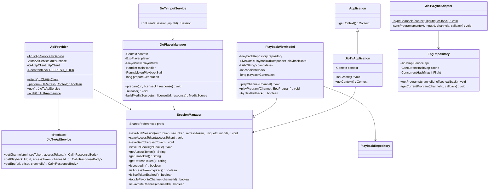
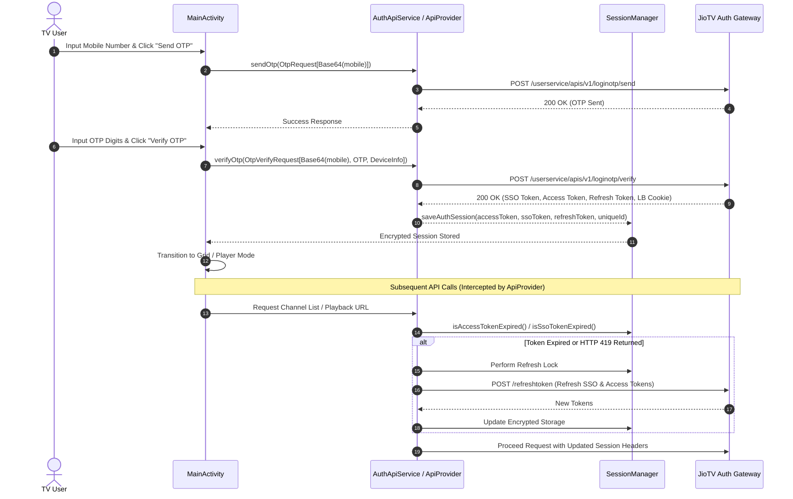
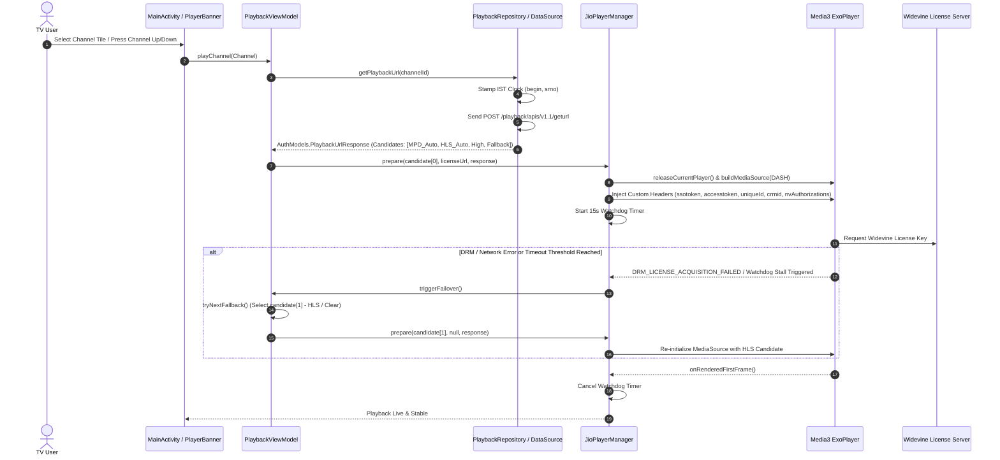
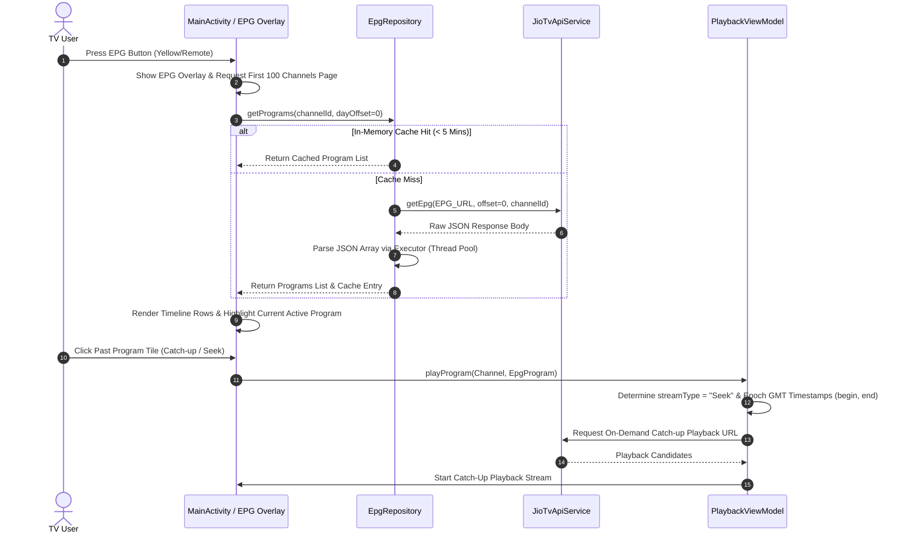
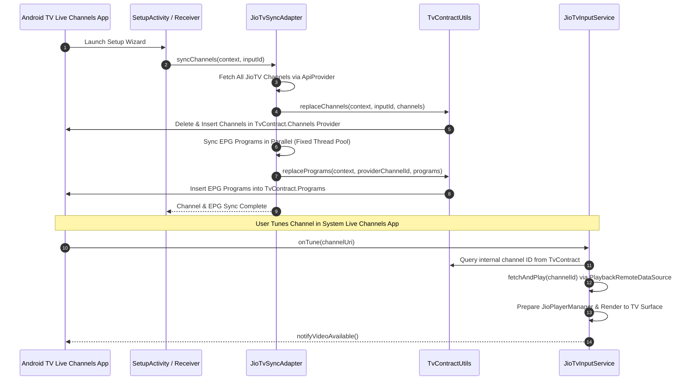
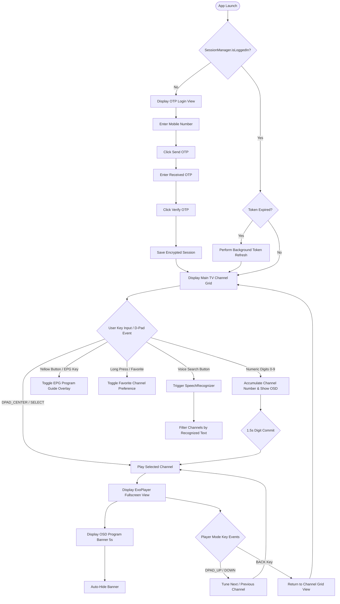
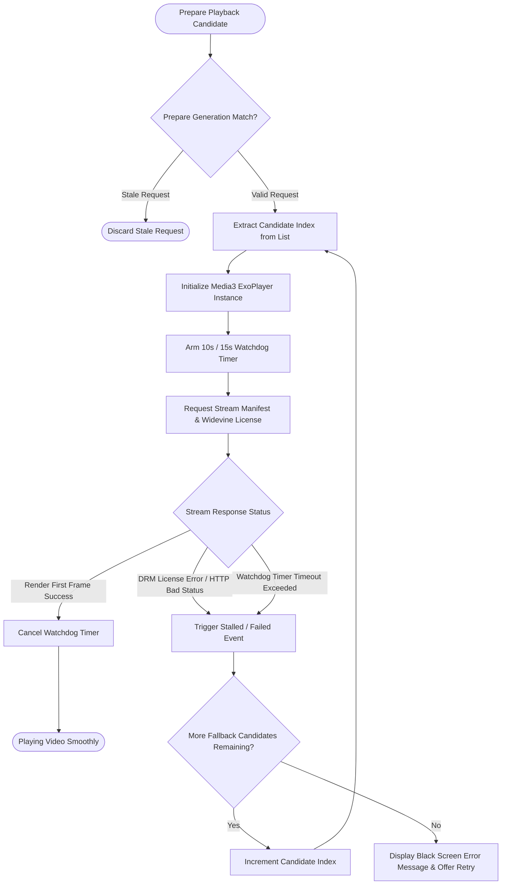

# JioTV-Lite
JioTV App for Android TV

Welcome to the **JioTV Lite ** ! This project is a production-grade, Leanback-optimized Android application designed for Android TV, set-top boxes (STBs), and handheld devices. It provides live channel streaming, interactive Electronic Program Guide (EPG) functionality with Catch-up/Seek capabilities, resilient Multi-Tier Widevine DRM playback, and native system-level integration with the **Android TV Live Channels** framework (`TvInputService`).

---

## Table of Contents

1. [Project Summary](#1-project-summary)
2. [Key Features](#2-key-features)
3. [System Architecture Diagram (Design Diagram)](#3-system-architecture-diagram-design-diagram)
4. [Class Diagram](#4-class-diagram)
5. [Sequence Diagrams](#5-sequence-diagrams)
   - [Sequence 1: OTP Authentication & Auto-Token Refresh](#sequence-1-otp-authentication--auto-token-refresh)
   - [Sequence 2: Channel Playback & Widevine DRM Handshake with Failover](#sequence-2-channel-playback--widevine-drm-handshake-with-failover)
   - [Sequence 3: Interactive EPG Loading & Catch-Up Playback](#sequence-3-interactive-epg-loading--catch-up-playback)
   - [Sequence 4: System-Level Android TV Input Channel Sync](#sequence-4-system-level-android-tv-input-channel-sync)
6. [Flowcharts](#6-flowcharts)
   - [Flowchart 1: User Journey & D-Pad Remote Input Navigation](#flowchart-1-user-journey--d-pad-remote-input-navigation)
   - [Flowchart 2: Multi-Tier Stream Failover & Watchdog Engine](#flowchart-2-multi-tier-stream-failover--watchdog-engine)
7. [Detailed System Logic & Design Mechanics](#7-detailed-system-logic--design-mechanics)
8. [Doxygen API Reference (Classes, Interfaces & Functions)](#8-doxygen-api-reference-classes-interfaces--functions)
9. [Developer Setup & How-To-Use Guide](#9-developer-setup--how-to-use-guide)

---

## 1. Project Summary

| Attribute | Details |
| :--- | :--- |
| **Application Package** | `com.example.jiotvservice` |
| **Application Name** | JioTV Lite / Integrated TV Service |
| **Min SDK / Target SDK** | Android 5.0 (API 21) / Target Android 14+ (Leanback Supported) |
| **Primary Language** | Java 8+ / Android SDK |
| **Media Engine** | AndroidX Media3 ExoPlayer (`v1.x`), MPEG-DASH, Widevine Modular DRM, HLS |
| **Networking & HTTP** | Retrofit 2, OkHttp 4 (`JavaNetCookieJar` + `CookieManager` for Broadpeak CDN) |
| **Security & Storage** | AndroidX Security Crypto (`EncryptedSharedPreferences` with MasterKey AES-256) |
| **UI Paradigm** | Jetpack MVVM (ViewModel + LiveData), Leanback D-Pad Focus Engine, Custom Views |
| **TV Framework Integration** | `TvInputService`, `TvContract`, `TvInputInfo`, System Live Channels EPG Sync |

---

## 2. Key Features

- **OTP Authentication & Token Management:** Secure mobile OTP verification with Base64 payload encoding. Dynamic JWT token expiry calculation and HTTP interceptor for silent auto-refresh of SSO and Access tokens.
- **Secure Encrypted Storage:** AES-256 GCM encrypted storage for user sessions, auth credentials, subscriber IDs, last-watched channels, and favorite channel preferences.
- **TV Leanback Focus Navigation:** Complete D-pad remote control support for TV devices (up, down, left, right, center/select, back, numbers 0-9 for channel entry, voice search trigger).
- **Interactive Electronic Program Guide (EPG):** Horizontal multi-row program guide with live progress indicators, paginated channel loading (100 channels per batch), date selector, and in-memory caching.
- **Catch-up & Live TV Streaming:** Seamless switching between current Live broadcasts (`stream_type=Live`) and past Catch-Up programs (`stream_type=Seek`).
- **Resilient Multi-Tier Player Engine:** Multi-candidate playback (MPD Widevine Live -> HLS -> High Bitrate -> Fallback URL) with automated 10s/15s watchdog stall detection and DRM failover.
- **System TV Input Service:** Exposes JioTV as a hardware TV input channel source for Android TV's system `TvProvider` and the native Google Live Channels app.

---

## 3. System Architecture Diagram (Design Diagram)

```mermaid
graph TD
    subgraph UI_Layer ["UI Layer (Leanback TV & Handheld)"]
        MA["MainActivity<br/>(Main UI Controller & Remote Navigation)"]
        SA["SetupActivity<br/>(TV Channel Setup Wizard)"]
        CTA["ChannelTileAdapter<br/>(Channel Grid Views)"]
        CLL["ChannelLogoLoader<br/>(Bitmap LRU Cache & Loader)"]
        PB["Player Program Banner<br/>(OSD Controls & Favorites)"]
    end

    subgraph Architecture_Layer ["Jetpack Architecture / MVVM"]
        VM["PlaybackViewModel<br/>(State, Generation & Fallback State)"]
        VMF["PlaybackViewModelFactory"]
    end

    subgraph Data_Repository_Layer ["Data & Repository Layer"]
        PR["PlaybackRepository<br/>(Playback Orchestration)"]
        PRDS["PlaybackRemoteDataSource<br/>(Live & Seek API Requests)"]
        ER["EpgRepository<br/>(EPG Fetching, De-duplication & Caching)"]
        EP["EpgProgram<br/>(Program Model)"]
        CH["Channel<br/>(Channel Model & Deserializers)"]
    end

    subgraph Session_Security_Layer ["Session & Security Layer"]
        SM["SessionManager<br/>(EncryptedSharedPreferences AES-256)"]
        DIF["DeviceInfoFactory<br/>(Hardware / Android ID Generator)"]
    end

    subgraph Network_API_Layer ["Network & API Layer"]
        AP["ApiProvider<br/>(OkHttp Singleton & Refresh Lock)"]
        JTS["JioTvApiService<br/>(Retrofit Content Endpoints)"]
        AAS["AuthApiService<br/>(Retrofit OTP/Token Endpoints)"]
        PAS["PlaybackApiService<br/>(Retrofit Playback URL Endpoints)"]
        PRC["PlaybackRequestClock<br/>(IST Timestamp Generator)"]
        RRR["RawResponseReader<br/>(Chunked GZIP Decompressor)"]
    end

    subgraph Media_Engine_Layer ["Media Engine & DRM Layer"]
        JPM["JioPlayerManager<br/>(ExoPlayer Lifecycle & Watchdog)"]
        JHDSF["JioHttpDataSourceFactory<br/>(Header Ingestion)"]
        EXO["AndroidX Media3 ExoPlayer<br/>(DASH / Widevine DRM / HLS)"]
    end

    subgraph System_TV_Integration ["Android TV Integration"]
        JTIS["JioTvInputService<br/>(TvInputService implementation)"]
        JTSA["JioTvSyncAdapter<br/>(TvProvider Channel & Program Sync)"]
        TCU["TvContractUtils<br/>(Database CRUD Helper)"]
        IPR["InitializeProgramsReceiver<br/>(BroadcastReceiver)"]
    end

    %% Component Connections
    MA --> VM
    VM --> PR
    PR --> PRDS
    PRDS --> PAS
    MA --> ER
    ER --> JTS
    MA --> SM
    MA --> JPM
    JPM --> EXO
    JPM --> JHDSF
    JHDSF --> AP

    AP --> AAS
    AP --> JTS
    AP --> PAS
    AP --> SM

    JTIS --> JPM
    JTIS --> PRDS
    SA --> JTSA
    IPR --> JTSA
    JTSA --> TCU
    JTSA --> ER
```



---

## 4. Class Diagram



---

## 5. Sequence Diagrams

### Sequence 1: OTP Authentication & Auto-Token Refresh



---

### Sequence 2: Channel Playback & Widevine DRM Handshake with Failover



---

### Sequence 3: Interactive EPG Loading & Catch-Up Playback



---

### Sequence 4: System-Level Android TV Input Channel Sync



---

## 6. Flowcharts

### Flowchart 1: User Journey & D-Pad Remote Input Navigation



---

### Flowchart 2: Multi-Tier Stream Failover & Watchdog Engine



---

## 7. Detailed System Logic & Design Mechanics

### 7.1. Session Security & Token Life Cycle
- **MasterKey Encryption:** Uses AndroidX `EncryptedSharedPreferences` backed by AES-256 GCM value encryption and AES-256 SIV key encryption.
- **JWT Expiry Parsing:** Decodes JWT token payloads without external dependencies using Base64 URL-safe decoding and JSON parsing to extract the `exp` claim.
- **Synchronized Refresh Lock:** `ApiProvider` utilizes a `ReentrantLock` (`REFRESH_LOCK`) to serialize token refresh requests across multi-threaded operations, preventing duplicate refresh calls.
- **HTTP 419 Interceptor:** OkHttp network interceptors automatically catch HTTP 419 authentication timeout errors, execute a full token refresh, and transparently retry the failed HTTP request.

### 7.2. Resilient Streaming & Widevine DRM Architecture
- **Broadpeak CDN Session Persistence:** A shared static `CookieManager` (`ACCEPT_ALL`) and `JavaNetCookieJar` maintain CDN cookie state across player re-creations.
- **Custom Header Propagation:** `JioHttpDataSourceFactory` injects essential JioTV authorization headers (`ssotoken`, `accesstoken`, `uniqueId`, `subscriberId`, `deviceId`, `crmid`, `nvAuthorizations`, `usergroup`, `appkey`) into every manifest segment and DRM license acquisition request.
- **Watchdog Stall Engine:** Monitors video playback state. If no video frames are rendered within 10–15 seconds of initialization, or if Widevine DRM key acquisition encounters a hardware/handshake error, the player automatically releases the failing stream and transitions to the next available fallback candidate URL.

### 7.3. Electronic Program Guide (EPG) Engine
- **In-Flight Request De-duplication:** Concurrent requests for the same channel and day offset share a single pending network call via `inFlight` thread-safe maps.
- **Memory Caching:** Cached EPG program arrays are preserved in a `ConcurrentHashMap` with a 5-minute Time-To-Live (TTL).
- **Background Array Parsing:** A fixed thread pool executor parses nested JSON fields (`epg`, `result`, `data`) and handles varying timestamp formats safely without blocking the UI main loop.

### 7.4. Android TV Integration & Live Channels Sync
- **TV Input Service (`JioTvInputService`):** Implements `TvInputService.Session` to provide stream rendering on native TV `Surface` instances provided by Google Live Channels or third-party TV launcher apps.
- **TV Provider Contract (`TvContractUtils`):** Synchronizes JioTV channel lists and program schedules directly into Android TV's `TvContract.Channels` and `TvContract.Programs` system databases.

---

## 8. Doxygen API Reference (Classes, Interfaces & Functions)

Below is the complete Doxygen-styled documentation covering all core packages, classes, interfaces, enums, functions, and parameters in the codebase.

```java
/**
 * @file JioTvApplication.java
 * @brief Application entry point maintaining global context reference.
 */
package com.example.jiotvservice;

import android.app.Application;
import android.content.Context;

/**
 * @class JioTvApplication
 * @brief Top-level Application class for JioTV Service.
 */
public class JioTvApplication extends Application {
    private static Context context;

    /**
     * @brief Called when the application is starting.
     */
    @Override
    public void onCreate() {
        super.onCreate();
        context = getApplicationContext();
    }

    /**
     * @brief Retrieves the application-level context.
     * @return Context Global application context instance.
     */
    public static Context getContext() {
        return context;
    }
}
```

```java
/**
 * @file SessionManager.java
 * @brief Manages encrypted persistent storage for authentication credentials and user preferences.
 */
package com.example.jiotvservice.session;

import android.content.Context;
import android.content.SharedPreferences;

/**
 * @class SessionManager
 * @brief Wraps EncryptedSharedPreferences for secure token and preference management.
 */
public final class SessionManager {

    /**
     * @brief Initializes encrypted storage using MasterKey AES-256.
     * @param context Application context.
     * @throws IllegalStateException If MasterKey or SharedPreferences initialization fails.
     */
    public SessionManager(Context context);

    /**
     * @brief Stores the full set of user authentication tokens.
     * @param authToken OAuth access token.
     * @param ssoToken Single Sign-On token.
     * @param refreshToken Refresh token.
     * @param uniqueId Unique user subscriber identifier.
     * @param mobile Registered mobile number.
     */
    public void saveAuthSession(String authToken, String ssoToken, String refreshToken, String uniqueId, String mobile);

    /**
     * @brief Saves updated Single Sign-On token.
     * @param ssoToken New SSO token string.
     */
    public void saveSsoToken(String ssoToken);

    /**
     * @brief Saves updated OAuth access token.
     * @param accessToken New Access token string.
     */
    public void saveAccessToken(String accessToken);

    /**
     * @brief Saves Broadpeak CDN load balancer cookie.
     * @param lbCookie CDN load balancer cookie value.
     */
    public void saveLbCookie(String lbCookie);

    /** @return String Currently stored OAuth Access Token. */
    public String getAccessToken();

    /** @return String Currently stored SSO Token. */
    public String getSsoToken();

    /** @return String Currently stored Refresh Token. */
    public String getRefreshToken();

    /** @return String Currently stored Unique User ID. */
    public String getUniqueId();

    /** @return String Currently stored Subscriber ID. */
    public String getSubscriberId();

    /** @return String Currently stored Load Balancer Cookie. */
    public String getLbCookie();

    /**
     * @brief Checks if a complete user session exists.
     * @return boolean True if SSO token, access token, and refresh token are present.
     */
    public boolean isLoggedIn();

    /**
     * @brief Determines whether the Access Token is expired based on JWT claims or fallback TTL.
     * @return boolean True if access token requires refresh.
     */
    public boolean isAccessTokenExpired();

    /**
     * @brief Determines whether the SSO Token is expired based on JWT claims or fallback TTL.
     * @return boolean True if SSO token requires refresh.
     */
    public boolean isSsoTokenExpired();

    /**
     * @brief Toggles a channel's favorite status.
     * @param channelId Target channel identifier.
     * @return boolean True if channel is now marked as favorite, false if removed.
     */
    public boolean toggleFavoriteChannel(int channelId);

    /**
     * @brief Checks if a channel is marked as favorite.
     * @param channelId Target channel identifier.
     * @return boolean True if channel is in user's favorites list.
     */
    public boolean isFavoriteChannel(int channelId);

    /** @brief Clears all stored session tokens and user data. */
    public void clearSession();
}
```

```java
/**
 * @file ApiProvider.java
 * @brief Central network provider for Retrofit services, OkHttp clients, and automated token refreshes.
 */
package com.example.jiotvservice.api;

import android.content.Context;
import okhttp3.OkHttpClient;

/**
 * @class ApiProvider
 * @brief Singleton factory providing configured API services and network interceptors.
 */
public final class ApiProvider {

    /**
     * @brief Obtains the shared OkHttpClient instance with session interceptors.
     * @return OkHttpClient Configured OkHttp client.
     */
    public static OkHttpClient client();

    /**
     * @brief Synchronously performs a full token refresh cycle (SSO Refresh -> Access Refresh -> Begin Session).
     * @param context Application context.
     * @return boolean True if all refresh operations succeeded, false otherwise.
     */
    public static boolean performFullRefresh(Context context);

    /**
     * @brief Refreshes the Single Sign-On (SSO) token using current credentials.
     * @param context Application context.
     * @return boolean True if SSO token was successfully updated.
     */
    public static boolean performSsoTokenRefresh(Context context);

    /**
     * @brief Refreshes the OAuth Access Token using current refresh token.
     * @param context Application context.
     * @return boolean True if access token was successfully updated.
     */
    public static boolean performAccessTokenRefresh(Context context);

    /**
     * @brief Obtains the primary JioTvApiService instance.
     * @return JioTvApiService Retrofit service for channels and EPG data.
     */
    public static JioTvApiService get();

    /**
     * @brief Obtains the AuthApiService instance.
     * @return AuthApiService Retrofit service for OTP authentication.
     */
    public static AuthApiService auth();
}
```

```java
/**
 * @file JioPlayerManager.java
 * @brief Manages ExoPlayer instance lifecycle, MediaSource creation, Widevine DRM configuration, and watchdog timers.
 */
package com.example.jiotvservice.player;

import android.content.Context;
import android.view.Surface;
import androidx.media3.exoplayer.ExoPlayer;
import androidx.media3.ui.PlayerView;

/**
 * @class JioPlayerManager
 * @brief High-level player wrapper managing media preparation, DRM key headers, and stall watchdog failover.
 */
public class JioPlayerManager {

    /**
     * @interface Listener
     * @brief Callback interface for player events such as playback stall detection.
     */
    public interface Listener {
        /** @brief Fired when watchdog detects playback stall or DRM license error. */
        void onPlaybackStall();
    }

    /**
     * @brief Constructs a JioPlayerManager.
     * @param context Application context.
     * @param session Active session manager.
     */
    public JioPlayerManager(Context context, SessionManager session);

    /**
     * @brief Sets the event listener.
     * @param listener Event listener instance.
     */
    public void setListener(Listener listener);

    /**
     * @brief Attaches a target PlayerView.
     * @param playerView Media3 PlayerView component.
     */
    public void setPlayerView(PlayerView playerView);

    /**
     * @brief Attaches a direct video rendering Surface.
     * @param surface Target output surface.
     */
    public void setSurface(Surface surface);

    /**
     * @brief Obtains or initializes the underlying ExoPlayer instance.
     * @return ExoPlayer Configured ExoPlayer object.
     */
    public ExoPlayer getPlayer();

    /**
     * @brief Prepares and starts playback for a target video URL and optional DRM license.
     * @param url Video stream URL (DASH .mpd or HLS .m3u8).
     * @param licenseUrl Widevine DRM license acquisition URL.
     * @param response Original PlaybackUrlResponse containing header attributes.
     */
    public void prepare(String url, String licenseUrl, AuthModels.PlaybackUrlResponse response);

    /**
     * @brief Stops, releases player resources, and unbinds views.
     */
    public void release();
}
```

```java
/**
 * @file EpgRepository.java
 * @brief Repository for Electronic Program Guide (EPG) fetching, thread-safe parsing, and caching.
 */
package com.example.jiotvservice.epg;

import android.content.Context;
import java.util.List;

/**
 * @class EpgRepository
 * @brief Handles EPG data operations with 5-minute in-memory caching and request de-duplication.
 */
public class EpgRepository {

    /**
     * @interface Callback
     * @brief Completion callback for EPG asynchronous requests.
     */
    public interface Callback {
        /**
         * @brief Invoked upon successful program list retrieval.
         * @param programs List of parsed EpgProgram instances.
         */
        void onSuccess(List<EpgProgram> programs);

        /**
         * @brief Invoked upon network or parsing failure.
         * @param message Failure explanation.
         */
        void onFailure(String message);
    }

    /**
     * @brief Fetches EPG program guide for a given channel and day offset.
     * @param channelId Target channel ID.
     * @param offset Day offset (0 = today, -1 = yesterday, +1 = tomorrow).
     * @param callback Callback object.
     */
    public void getPrograms(int channelId, int offset, Callback callback);

    /**
     * @brief Retrieves only the currently active live program for a given channel.
     * @param channelId Target channel ID.
     * @param callback Callback object receiving a list with 1 item or empty.
     */
    public void getCurrentProgram(int channelId, Callback callback);

    /** @brief Clears in-memory EPG cache. */
    public void clear();

    /** @brief Shuts down background parsing executor thread pool. */
    public void shutdown();
}
```

```java
/**
 * @file JioTvSyncAdapter.java
 * @brief Helper for synchronizing JioTV channels and EPG data into Android TV system TvProvider.
 */
package com.example.jiotvservice.tv;

import android.content.Context;

/**
 * @class JioTvSyncAdapter
 * @brief Syncs channel metadata and EPG programs with TvContract for Google Live Channels framework.
 */
public final class JioTvSyncAdapter {

    /**
     * @interface SyncCallback
     * @brief Callback interface for sync status notifications.
     */
    public interface SyncCallback {
        /**
         * @brief Invoked when channel sync completes.
         * @param count Number of channels synchronized.
         */
        void onSuccess(int count);

        /**
         * @brief Invoked when sync encounters an error.
         * @param message Error description.
         */
        void onError(String message);
    }

    /**
     * @brief Synchronizes JioTV channels and EPG entries into TvProvider.
     * @param context Application context.
     * @param inputId TV Input ID string built from ComponentName.
     * @param callback Sync progress callback.
     */
    public static void syncChannels(Context context, String inputId, SyncCallback callback);
}
```

---

## 9. Developer Setup & How-To-Use Guide

### 9.1. Prerequisites & Environment

- **Android Studio:** Android Studio Ladybug (2024.2.1+) or Android Studio Jellyfish / Meerkat.
- **Android SDK:**
  - Compile SDK: `34` or higher
  - Min SDK: `21` (Android 5.0 Lollipop)
  - Target SDK: `34`
- **JDK Version:** Java 17 (configured in Android Studio Gradle Settings)
- **Target Device:** Android TV Device / Emulator, Nexus Player, Chromecast with Google TV, or Android TV Box running Android 5.0+.

---

### 9.2. Building & Running the Project

#### Step 1: Clone Repository
```bash
git clone https://github.com/your-username/JioTV_Lite_EPG_Fixed.git
cd JioTV_Lite_EPG_Fixed
```

#### Step 2: Open in Android Studio
1. Open Android Studio and choose **File > Open...**
2. Select the repository root folder.
3. Allow Gradle Sync to finish downloading required dependencies (`androidx.media3`, `retrofit2`, `okhttp3`, `security-crypto`).

#### Step 3: Build APK
To build debug APK via Gradle CLI:
```bash
./gradlew assembleDebug
```
The compiled APK will be located at:
`app/build/outputs/apk/debug/app-debug.apk`

---

### 9.3. User Guide & Leanback TV Remote Usage

#### Initial Login Setup
1. Launch **JioTV Integrated** on your Android TV device.
2. In the login view, type your registered **Jio Mobile Number** using the D-pad or on-screen keyboard.
3. Click **Send OTP**.
4. Enter the received 6-digit OTP and click **Verify OTP**.
5. Once authenticated, the app secures your session and displays the interactive **Channel Grid**.

#### Navigating the Channel Grid
- **D-Pad Directional Keys (Up / Down / Left / Right):** Highlight channel tiles.
- **D-Pad Center / Select Key:** Launch live channel streaming.
- **Numeric Keys (0–9):** Enter channel numbers directly (e.g., press `1`, `0`, `2` to tune channel 102).
- **Yellow Key / EPG Button:** Toggle the interactive **EPG Program Guide Overlay**.
- **Favorite Key / Long Press:** Add or remove the active channel from your Favorites list.
- **Language / Category Filters:** Filter channel list by multi-select language or genre options.
- **Voice Search:** Click the Microphone icon or press the Voice button on your TV remote to speak a channel or program name.

---

### 9.4. Android TV Live Channels Integration Setup

To use JioTV as a system channel source within the native **Google Live Channels** application:

1. Install and launch the **Google Live Channels** app from Google Play Store on your TV.
2. Open **Settings > Channel Setup > Custom Inputs**.
3. Select **JioTV Integrated**.
4. The setup wizard (`SetupActivity`) will automatically sync all available channels and EPG entries into the Android TV `TvProvider` database.
5. Once completed, you can browse, channel-surf, and view JioTV guide data directly within the native Android TV Live Channels interface!

---

### 9.5. Troubleshooting Common Issues

| Issue / Symptom | Possible Cause | Resolution |
| :--- | :--- | :--- |
| **HTTP 419 Error** | Session token expired | The app automatically attempts token refresh. If refresh fails, log out and re-verify OTP. |
| **Video Stall / Black Screen** | DRM license handshake or CDN issue | The built-in Watchdog timer automatically switches candidates. Ensure device clock is correct. |
| **No Sound / Video Sync Issue** | Hardware codec limitation | Widevine L1 / L3 fallback is automatically handled by Media3 ExoPlayer. |
| **Live Channels Sync Fails** | Unauthenticated user state | Complete OTP login in the main app *before* running Live Channels channel setup. |

---

### 9.6. Repository Structure Overview

```
JioTV_Lite_EPG_Fixed/
├── app/
│   ├── src/main/
│   │   ├── java/com/example/jiotvservice/
│   │   │   ├── JioTvApplication.java          # Global Application Context
│   │   │   ├── api/                           # Retrofit API Services & Interceptors
│   │   │   ├── auth/                          # Device Info & Identifier Generators
│   │   │   ├── data/                          # Playback Remote Data Sources & Repositories
│   │   │   ├── epg/                           # EPG Program Model, Parser & Repository
│   │   │   ├── model/                         # Data Transfer Objects & Deserializers
│   │   │   ├── player/                        # ExoPlayer Engine, Custom DataSource & Headers
│   │   │   ├── session/                       # AES-256 Encrypted Session Storage
│   │   │   ├── tv/                            # Android TV TvInputService & TvProvider Sync
│   │   │   ├── ui/                            # MainActivity, ViewModels, Custom Adapters
│   │   │   └── util/                          # Async Application File & Console Logger
│   │   ├── res/                               # Layout XMLs, Drawables, Styles & Metadata
│   │   └── AndroidManifest.xml                # TV Features, Permissions & Services
│   └── build.gradle                           # App Module Build & Dependencies
├── build.gradle                               # Project Root Build Configuration
└── README.md                                  # Comprehensive Documentation
```

### Disclaimer
This project is developed solely for educational and learning purposes to understand live TV streaming workflows, system design, and ExoPlayer playback of DRM-protected content.

**Non-Commercial Use**: This project and its underlying source code are strictly not intended for commercial use or monetization.

**Modification & Usage**: Developers and users are permitted to copy and modify this codebase for their own learning needs.

**Limitation of Liability**: The repository owner holds no control over, and assumes no responsibility or liability for, any modifications, redistribution, or actions undertaken by third parties using this code.

**Content Disclaimer**: The repository owner does not host, stream, or own any media content, and assumes no liability for copyright or DRM infringements resulting from unauthorized third-party use.

---

*Developed with ❤️ for high-performance Leanback Android TV experiences.*
